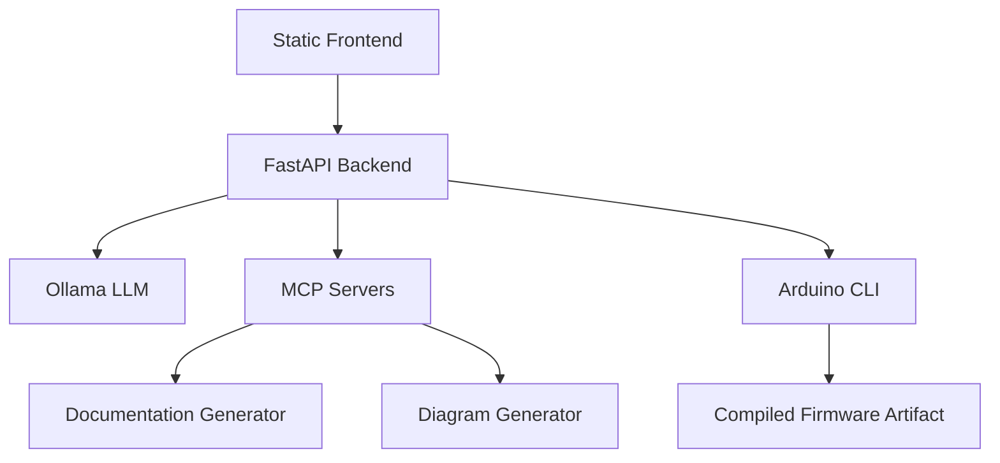

# ESP32 temperature sensor with MQTT publishing and OLED status display

Generated: 2026-02-15 14:47:04

## 1. Project Overview

Problem statement:
Current embedded firmware projects need repeatable, AI-assisted generation plus deterministic compile validation.

Objective:
Generate production-ready ESP32 firmware from requirements, validate dependencies, compile, and document results.

Target microcontroller:
ESP32 (default target profile), with board mapping handled in backend.

System workflow explanation:
Request -> code generation -> validation -> library detection -> compilation -> quality analysis -> documentation output.

AI + compilation pipeline summary:
FastAPI orchestrates Ollama inference, MCP analyses, and Arduino CLI compile checks in one flow.

## 2. System Architecture

High-level components:
- Frontend: static web app for prompt input and result visualization.
- FastAPI backend: orchestration, validation, retries, and response assembly.
- LLM (Ollama): firmware code generation.
- MCP servers: hardware and quality analysis + documentation helpers.
- Arduino CLI: deterministic compilation and diagnostics.



## 3. Hardware Requirements

- Microcontroller board: ESP32 DevKit V1 or compatible.
- Sensors: determined by include set and pin mappings in generated firmware.
- Actuators: derived from output pin assignments (e.g., LED, buzzer, relay, motor).
- Communication modules: WiFi/BLE/MQTT modules as required by include set.
- Power requirements: stable 5V USB input; ensure 3.3V GPIO-level-safe peripherals.

## 4. Pin Configuration Table

| Component | GPIO | Mode | Description |
|---|---:|---|---|
| Gas Sensor | 1883 | INPUT | Gas concentration sensing |
| WiFi Module | 0 | INPUT | Network connectivity |
| WiFi Module | 14 | INPUT | Network connectivity |
| WiFi Module | 12 | INPUT | Network connectivity |
| WiFi Module | 128 | INPUT | Network connectivity |
| WiFi Module | 64 | INPUT | Network connectivity |
| I2C SDA | 2 | INPUT | GPIO-connected peripheral |
| I2C SCL | 5 | INPUT | GPIO-connected peripheral |

## 5. Circuit Diagram (Embedded)

```mermaid
graph TD
    ESP32
    ESP32 -->|GPIO 1883| Gas Sensor (Sensor/Input)
    ESP32 -->|GPIO 0| WiFi Module (Sensor/Input)
    ESP32 -->|GPIO 14| WiFi Module (Sensor/Input)
    ESP32 -->|GPIO 12| WiFi Module (Sensor/Input)
    ESP32 -->|GPIO 128| WiFi Module (Sensor/Input)
    ESP32 -->|GPIO 64| WiFi Module (Sensor/Input)
    ESP32 -->|GPIO 2| I2C SDA (Sensor/Input)
    ESP32 -->|GPIO 5| I2C SCL (Sensor/Input)

```

## 6. Library Installation Guide

### Adafruit_SSD1306.h
Library dependency required by referenced APIs.

Arduino CLI:
```bash
arduino-cli lib install Adafruit_SSD1306
```

Arduino IDE:
1. Open Library Manager.
2. Search for `Adafruit_SSD1306`.
3. Install latest compatible version.

### ESP32MQTTClient.h
Library dependency required by referenced APIs.

Arduino CLI:
```bash
arduino-cli lib install ESP32MQTTClient
```

Arduino IDE:
1. Open Library Manager.
2. Search for `ESP32MQTTClient`.
3. Install latest compatible version.

### WiFi.h
ESP32 WiFi stack for network connectivity.

Arduino CLI:
```bash
arduino-cli lib install WiFi
```

Arduino IDE:
1. Open Library Manager.
2. Search for `WiFi`.
3. Install latest compatible version.

### Wire.h
I2C bus communication for digital peripherals.

Arduino CLI:
```bash
arduino-cli lib install Wire
```

Arduino IDE:
1. Open Library Manager.
2. Search for `Wire`.
3. Install latest compatible version.


## 7. Code Walkthrough (Detailed)

### Global Variables
Global state includes sensor objects, communication clients, and runtime control variables.

### Pin Definitions
Pin constants map peripherals to ESP32 GPIOs and isolate hardware mapping from logic.

### setup() Function
Performs hardware initialization, serial startup, peripheral configuration, and one-time subsystem bootstrapping.

### loop() Function
Executes the runtime control loop: sensor acquisition, decision logic, actuator update, and communication output.

### Interrupts (if any)
No interrupt handlers detected in the generated firmware.

### Communication Logic
Implements serial/network protocol flow for telemetry, commands, and status feedback.

### Error Handling
Includes guard conditions for invalid sensor reads, startup failures, and communication retries.

### Non-blocking Timing
Uses delay-based pacing; can be upgraded to millis()-based scheduling for better responsiveness.

## 8. Compilation & Performance Metrics

Code Generation Time: 438.11s
Compilation Time: 96.68s
Memory Usage: 0.45%
Flash Usage: N/A
RAM Usage: 0.45%
Lines of Code: 66
Optimization Notes: Prefer millis()-based scheduling and reduce blocking delays where possible.

## 9. Quality Analysis

- Code readability assessment: quality score reported as 95.
- Modularity score: inferred from function boundaries and responsibility separation.
- Embedded best practices followed: setup/loop structure, GPIO abstraction, and compile validation.
- Safety evaluation: GPIO voltage assumptions and peripheral usage must match board constraints.
- Potential improvements: stricter non-blocking patterns, stronger fault recovery, and structured telemetry.

## 10. Troubleshooting Guide (Expanded)

- Compilation errors: verify board FQBN, include directives, and Arduino core installation.
- Missing libraries: install dependencies via Arduino CLI or IDE library manager.
- Board mismatch: ensure selected board and FQBN map to target hardware.
- Serial monitor issues: confirm COM port, baud rate, and cable supports data.
- Power instability issues: use stable power supply and avoid overloading GPIO current limits.

## 11. Future Improvements

- OTA firmware updates.
- RTOS task-based scheduling.
- Power optimization and sleep-state orchestration.
- Web dashboard for telemetry and control.
- Cloud logging and remote observability.
- Hardware abstraction layers for board portability.
